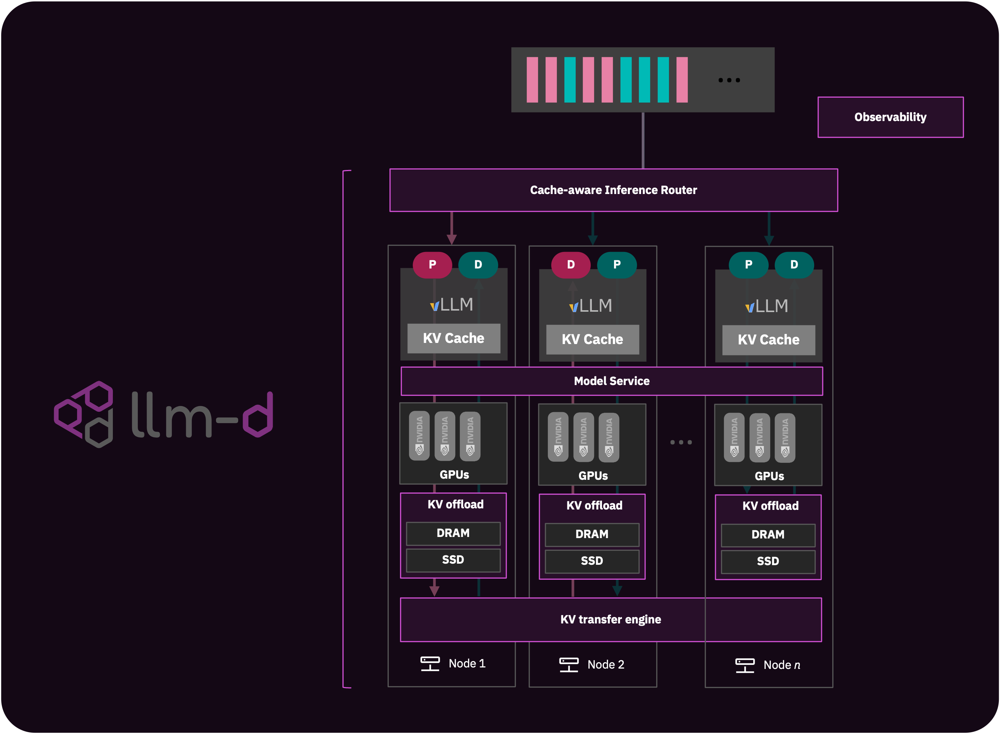

<p align="center">
  <picture>
    <source media="(prefers-color-scheme: dark)">
    
  </picture>
</p>

<h3 align="center">
Powering Distributed Gen AI Inference at Scale
</h3>

 [](https://...) [](https://github.com/llm-d/llm-d/blob/main/LICENSE) 
  <a href="...">
    
  </a>


## 📄 Overview

llm-d is a Kubernetes-native, high-performance distributed LLM inference framework designed to unlock production-scale AI inference. It takes you from your first inference response to full-scale production, emphasizing diverse hardware options and increased operational efficiency. The project focuses on providing efficient distributed inferencing on any Kubernetes cluster, building on proven production-grade standards. Its architecture is built for high performance and scalability, enhancing efficiency through intelligent resource orchestration with optimizations like prefill-decode disaggregation, advanced KV management, and AI-aware scheduling and routing.

llm-d prioritizes ease of deployment and use, addressing the operational needs of running large GPU clusters, including SRE concerns and day-2 operations. It is designed to be an expandable and evolving inference platform, featuring a set of core functionalities and experimental features. llm-d can be deployed as a production solution or used as components for experimentation to evolve distributed inference capabilities.


## 🧱 Architecture

llm-d includes the following main components:

- **Prefill/Decode Disaggregation:** separates the prefill and decode stages to optimize inference performance
- **KV Cache, Prefix, and Session-Aware Router and scheduler:** Incorporates plug points for customizable scorers to enhance routing and scheduling efficiency
- **KV Cache Manager:** Orchestrates KV offloading and transfer (using NIXL-based KV transfer)
- **Operational Telemetry:** Provides production-level monitoring and metrics through Prometheus and Grafana


<p align="center">
  <picture>
    <source media="(prefers-color-scheme: dark)">
    
  </picture>
</p>

See a detailed architecture [here](https://...).

### Core features 

- [**Prefill/Decode Disaggregation**](): 

- [**Dynamic and pluggable AI-aware inference scheduler**](): Provides scheduler components for routing AI inference requests within the LLM-d framework, including an "Endpoint Picker (EPP)" for optimized routing via Envoy's ext-proc feature. Built on Gateway API and GIE projects, it extends support with custom plugins like custom scorers and P/D Disaggregation.

- [**KV Cache Manager**](): A pluggable KVCache Manager for KVCache-aware routing in vLLM-based serving platforms. It aims to improve user experience by reducing Time-To-First-Token (TTFT) through higher KVCache hit rates and smart routing. It reduces serving costs by improving compute utilization and minimizing re-compute. It also enables system scalability with a distributed KVCache pool, allowing cache offloading, reuse, and seamless load balancing. See docs for more information.

- [**Model service**](): ModelService: Declaratively provisions and maintains Kubernetes resources needed to serve a base model for inference, automating management of prefill and decode deployments, inference pool, endpoint picker (EPP) deployment, relevant RBAC permissions, and optionally referencing BaseConfig for shared behavior presets. It supports disaggregated workloads, integrates with Gateway API for routing, enables auto-scaling, allows independent scaling, supports model loading from various sources, and includes value templating.

### Experimental 

- [**llm-sim**](): A tool for testing and development that mimics an ingerence engine responses (currently implementing vLLM's API) without running actual inference. It supports basic API endpoints and Prometheus metrics, and can operate in echo mode (returns received text) or random mode (returns predefined sentences). Timing of responses can be adjusted, and it can be run standalone or in a Pod for testing.
- [**llm-d-benchmarking**](): Tooling integrating fmperf: A cloud-native, Kubernetes-based benchmarking tool that automates deployment and performance testing of LLM inference systems. It streamlines benchmarking by orchestrating end-to-end workflows, allowing organizations to efficiently measure inference throughput and latency without the overhead of prolonged GPU cluster configuration and load tester setup. 

## 🚀 Getting Started

llm-d can be installed as a full solution, customizing enabled features, or through its individual components for experimentation.

### Deploying as as solution

llm-d's deployer can be used to that installed it as a solution using a single Helm chart on Kubernetes.

> [!TIP]
> See the guided expericience with our [quickstart](https://github.com/neuralmagic/llm-d-deployer/blob/main/quickstart/README.md).

### Experimenting and developing with llm-d

llm-d is repo is a metaproject with subcomponents can that can be cloned indvidually. 

To clone all the components:
```
    git clone --recurse-submodules https://github.com/llm-d/llm-d.git 
``` 

> [!TIP]
> As a customizatoin example, see [here]() a template for adding a scheduler scorer.

 ## 📦 Releases

Visit our [GitHub Releases page](https://github.com/llm-d/llm-d/releases) and review the release notes to stay updated with the latest releases.


 ## 👋 Community

### Contribute

We appreciate contributions to the code, examples, integrations, documentation, bug reports, and feature requests! Your feedback and involvement are crucial in helping llm-d grow and improve. Below are some ways you can get involved:

- [**DEVELOPING**](https://github.com/llm-d/llm-d/blob/main/DEVELOPING.md) - Development guide for setting up your environment and making contributions.
- [**CONTRIBUTING**](https://github.com/llm-d/llm-d/blob/main/CONTRIBUTING.md) - Guidelines for contributing to the project, including code standards, pull request processes, and more.
- [**CODE_OF_CONDUCT**](https://github.com/llm-d/llm-d/blob/main/CODE_OF_CONDUCT.md) - Our expectations for community behavior to ensure a welcoming and inclusive environment.

### Community meeting

A community meeting for llm-d will be hosted weekly. Meeting Details:

\<TBD\>

### Join

We invite you to join our growing community of developers, researchers, and enthusiasts passionate about scalinng and optimizing inference. Whether you're looking for help, want to share your own experiences, or stay up to date with the latest developments, there are plenty of ways to get involved:

- [**llm-d Community Slack**](https://...) - Join our Slack channel to connect with other llm-d users and developers. Ask questions, share your work, and get real-time support.
- [**GitHub Issues**](https://github.com/llm-d/llm-d/issues) - Report bugs, request features, or browse existing issues. Your feedback helps us improve llm-d.
- [**Subscribe to Updates**](https://...) - Sign up for the latest news, announcements, and updates about llm-d, webinars, events, and more.
- [**Contact Us**](http://...) - Use our contact form for general questions about llm-d.

<div>
<h3><font size="4"> Contributors </font></h3>
</div>
<br>

<center>
<a href="https://github.com/llm-d/llm-d/graphs/contributors">
  
</a>
</center>
<br>
<br>

\<coming...\>

## License

This project is licensed under Apache License 2.0. See the LICENSE file for details.
