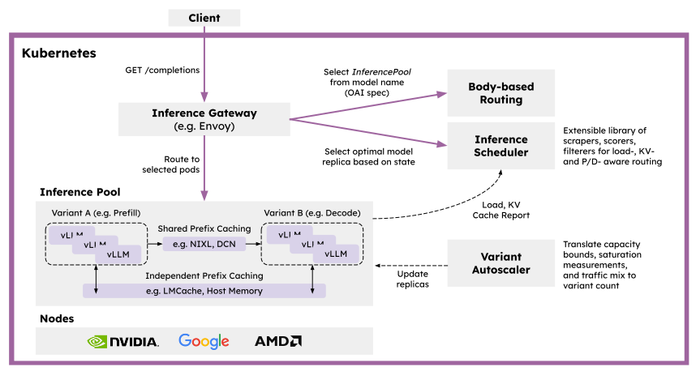

<p align="center">
  <picture>
    <source media="(prefers-color-scheme: dark)">
    
  </picture>
</p>

<h3 align="center">
Kubernetes-Native Distributed Inference at Scale
</h3>

 [](https://...) [](https://github.com/llm-d/llm-d/blob/main/LICENSE) 
  <a href="...">
    
  </a>

Latest News 🔥
- [2025-05] Coreweave, Google, IBM Research, NVIDIA, and Red Hat launched the `llm-d` community. Check out [our blog post - UPDATE]() and [press release - UPDATE]().

## 📄 About

`llm-d` is a Kubernetes-native distributed inference serving stack - a well-lit path for anyone to serve at scale, with the fastest time-to-value and competitive performance per dollar for most models across most hardware accelerators.

With `llm-d`, users can operationalize GenAI deployments with a modular solution that leverages the latest distributed inference optimizations like KV-cache aware routing and disaggregated serving, co-designed and integrated with the Kubernetes operational tooling in [Inference Gateway (IGW)](https://github.com/kubernetes-sigs/gateway-api-inference-extension).

Built by leaders in the Kubernetes and vLLM projects, `llm-d` is a community-driven, Apache-2 licensed project with an open development model.

## 🧱 Architecture

`llm-d` adopts a layered architecture on top of industry-standard open technologies: vLLM, Kubernetes, and Inference Gateway.

<p align="center">
  <picture>
    <source media="(prefers-color-scheme: dark)">
    
  </picture>
</p>

Key features of `llm-d` include:

- **vLLM-Optimized Inference Scheduler:** `llm-d` builds on IGW's pattern for customizable “smart” load-balancing via the Endpoint Picker Protocol (EPP) to define vLLM-optimized scheduling. Leveraging operational telemetry, Inference Scheduler implements and scoring algorithms to make decisions with P/D-, KV-cache-, SLA-, and load-awareness. Advanced teams can implement their own scorers to further customize, while benefiting from other features in IGW, like flow control and latency-aware balancing. [See our Northstar design](https://docs.google.com/document/d/1kE1LY8OVjiOgKVD9-9Po96HODbTIbgHp4qgvw06BCOc/edit?tab=t.0#heading=h.4rgkvvo5gnle)

- **Disaggregated Serving with vLLM:** `llm-d` leverages vLLM’s support for disaggregated serving to run prefill and decode on independent instances, using high-performance transport libraries like NVIDIA’s NIXL. In `llm-d`, we plan to support latency-optimized implementation using fast interconnects (IB, RDMA, ICI) and throughput optimized implementation using data-center networking. [See our Northstar design](https://docs.google.com/document/d/1FNN5snmipaTxEA1FGEeSH7Z_kEqskouKD1XYhVyTHr8/edit?tab=t.0)

- **Disaggregated Prefix Caching with vLLM:** `llm-d` uses vLLM's KVConnector API to provide a pluggable cache for previous calculations, including offloading KVs to host, remote storage, and systems like LMCache. We plan to support two KV caching schemes. [See our Northstar design](https://docs.google.com/document/d/1inTneLEZTv3rDEBB9KLOB9K6oMq8c3jkogARJqdt_58/edit?tab=t.0)
    - *Independent* (north-south) caching with offloading to local memory and disk, providing a zero operational cost mechanism for offloading.
    - *Shared* (east-west) caching with KV transfer between instances and shared storage with global indexing, providing potential for higher performance at the cost of a more operationally complex system.

- **Variant Autoscaling over Hardware, Workload, and Traffic** (🚧): We plan to implement a traffic- and hardware-aware autoscaler that (a) measures the capacity of each model server instance, (b) derive a load function that takes into account different request shapes and QoS, and (c) assesses recent traffic mix (QPS, QoS, and shapes)
Using the recent traffic mix to calculate the optimal mix of instances to handle prefill, decode, and latency-tolerant requests, enabling use of HPA for SLO-level efficiency. [See our Northstar design](https://docs.google.com/document/d/1inTneLEZTv3rDEBB9KLOB9K6oMq8c3jkogARJqdt_58/edit?tab=t.0)


## 🚀 Getting Started

`llm-d` can be installed as a full solution, customizing enabled features, or through its individual components for experimentation.

### Deploying as as solution

llm-d's deployer can be used to that installed it as a solution using a single Helm chart on Kubernetes.

> [!TIP]
> See the guided experience with our [quickstart](https://github.com/neuralmagic/llm-d-deployer/blob/main/quickstart/README.md).

### Experimenting and developing with llm-d

llm-d is repo is a metaproject with subcomponents can that can be cloned individually.

To clone all the components:
```
    curl -s https://api.github.com/orgs/llm-d/repos?per_page=100 | jq -r '.[].clone_url' | xargs git clone
``` 

> [!TIP]
> As a customization example, see [here]() a template for adding a scheduler scorer.

## 📦 Releases

Visit our [GitHub Releases page](https://github.com/llm-d/llm-d-deployer/releases) and review the release notes to stay updated with the latest releases.


## Contribute

### Guidelines
- See [our project overview](PROJECT.md) for more details on our development process and governance.

### Connect
- We use Slack to discuss development across organizations. Please join: [Link to Slack - UPDATE](https://...)
- We host a weekly standup for contributors on Wednesdays at 1230pm ET. Please join: [Meeting Details](https://calendar.google.com/calendar/event?action=TEMPLATE&tmeid=NG9yZ3AyYTN0N3VlaW01b21xbWV2c21uNjRfMjAyNTA1MjhUMTYzMDAwWiByb2JzaGF3QHJlZGhhdC5jb20&tmsrc=robshaw%40redhat.com&scp=ALL)
- We use Google Groups to share architecture diagrams and other content. Please join: [Google Group](https://groups.google.com/g/llm-d-contributors)

## License

This project is licensed under Apache License 2.0. See the [LICENSE file](LICENSE) for details.
