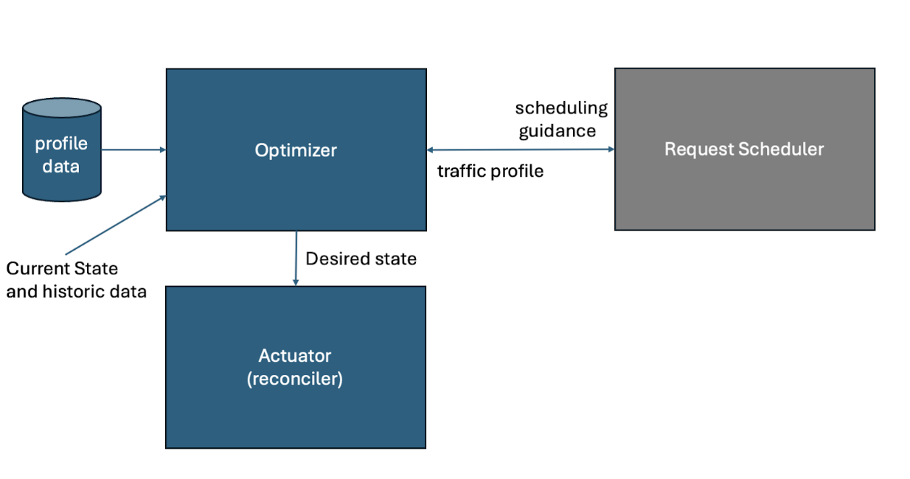

<!--

Copy this file as a template for a proposal. Inspired by the Kubernetes
enhancement proposal process at https://github.com/kubernetes/enhancements/blob/3d467242870c26d24cfcb44e0c394ea599e08d02/keps/NNNN-kep-template/README.md

-->
Variant AutoScaler Proposal 

## Summary

<!--
This section is incredibly important for producing high-quality, user-focused
documentation such as release notes or a development roadmap. It should be
possible to collect this information before implementation begins, in order to
avoid requiring implementors to split their attention between writing release
notes and implementing the feature itself. Proposal authors and reviewers
should help to ensure that the tone and content of the `Summary` section is
useful for a wide audience.

A good summary is probably at least a paragraph in length.

In this section and below, wrap lines to a reasonable length to make it
easier for reviewers to cite specific portions, and to minimize diff churn on
updates.
-->

The variant autoscaler dynamically calculates the optimal mix of accelerator topologies (including, scaling up and down as necessary) for each available model server configuration that optimally serves the current multidimensional traffic load.

1. We strive to have a loosely coupled design of a variant autoscaler relative to the request scheduler while having both working together towards a common goal, which is maximizing latency SLO attainment with the least cost of hardware. 
2. The variant autoscaler manages the mix of topology assignments (e.g. accelerator type, single-node vs. multi-node, intra-node and inter-node RMDA and DCN connection type, different TP, EP, DP and max batch size) and dynamic traffic patterns.
3. The request scheduler manages individual requests and makes point-in-time scheduling decisions for each request according to the bucketization guidance from the variant autoscaler.
    1. A normalized “load” signal for the request scheduler to be used as a part of flow control
4. The autoscaler does not assume that there is offline data, but takes advantage of it when it exists. 
5. The autoscaler must handle disaggregation, I.e., work where servers dynamically take distinct roles such as P, D or P+D (queueing model will be able to handle this, we do not need any special design). 
6. We should be able to provide evidence for statistical improvement in utilization and cost over a period of time. 

## Motivation

<!--
This section is for explicitly listing the motivation, goals, and non-goals of
this proposal.  Describe why the change is important and the benefits to users. The
motivation section can optionally provide links to [experience reports] to
demonstrate the interest in a proposal within the wider project.

[experience reports]: https://go.dev/wiki/ExperienceReports
-->

AI users are running multiple models that differ in size, architecture, density, etc. In addition, the traffic shape is dynamic and comprises all combinations of short and long sequence lengths and outputs, with varying degrees of prefix similarity across requests. In addition, some requests may be interactive and latency-critical, while others could be throughput-oriented batch jobs, such as content summarization.

Our users want to use the least amount of resources to serve all requests such that request latency SLOs are met, such as Time To First Token (TTFT), Inter Token Latency (ITL), time to last token/request latency(TTLT) and Throughput (THP) i.e. the number of tokens generated per second, freeing resources for other uses such as batch workloads. 

Such environmental heterogeneity raises a multitude of challenges in scaling across multiple models and users, particularly when operating under usage-based billing models. A potential solution must optimally adjust the topology and configuration assigned to each model. 

Moreover, it must independently scale the prefill and decode instances to enable an effective disaggregation strategy. 

### Goals

<!--
List the specific goals of the proposal. What is it trying to achieve? How will we
know that this has succeeded?
-->

1. Method to adjust the accelerator and configuration set to serve requests in a performant way with the least amount of resources and cost. 
2. Show the advantages of the approach relative to the baseline, and additionally, the benefits of a heterogeneous set of resources and topology.  
3. The method should work independently of KVCache configuration (it is orthogonal).
4. The method should work for different and dynamically changing traffic patterns. 
5. Architecture should be extensible, allowing for experimentation with new auto-scalers or the use of different auto-scalers for different models. 
6. The method should minimize changes and avoid oscillations and identify the sequence of steps to get to the desired state without any disruptions. 
7. The technique will be able to work with or without offline profiling.
8. The method can handle disaggregation, i,e when different instances are dynamically tagged and used for prefill only, or for decode only, or as both. 
9. The method should be able to respect GLOBAL constraints on the availability of each accelerator type, and other global constraints (e.g., cap on energy). 

### Non-Goals

<!--
What is out of scope for this proposal? Listing non-goals helps to focus discussion
and make progress.
-->

* This project is not concerned with KVCache optimization. However, it must be able to adjust and work well with different caching scenarios. 
* For the next 3-6 months other constraints such as energy are out of scope. 
* For the next 3-6 months we can start with assuming that only partial offline data is available
* For the next 3-6 months we rely on Kubernetes to actuate the change with no further optimization (such as ordering)
* For next 3-6 months we do not consider agentic use cases where models are connected in a topology
* For the next 3-6 months not considering dynamic  LORA loading or just assuming it is registered across all instances 
* Next 3-6 month not focused on anything but transformer based LLMs 
* Next 3-6 months not focused on anything but the following SLOs TTFT, ITL, and TTLT in some cases

## Proposal

<!--
This is where we get down to the specifics of what the proposal actually is.
This should have enough detail that reviewers can understand exactly what
you're proposing, but should not include things like API designs or
implementation. What is the desired outcome and how do we measure success?.
The "Design Details" section below is for the real
nitty-gritty.
-->

High-Level architecture

The optimizer receives as input historical profiled data, as well as the current state of resources, queues, and other relevant information. It uses that data to: 
1. Provide scheduling guidance to the Request Scheduler
2. Calculate a new optimal desired state (number and types of instances and configuration)
 
Optimization control loop: The control loop comprises (1) a Collector to get data about the inference servers through Prometheus and server deployments, (2) an Optimizer to make decisions, (3) an Actuator to realize such decisions by updating server deployments or by writing directly to Prometheus relying on HPA to affect changes, and (4) a periodic Controller that has access to static and dynamic data

### User Stories (Optional)

<!--
Detail the things that people will be able to do if this proposal is implemented.
Include as much detail as possible so that people can understand the "how" of
the system. The goal here is to make this feel real for users without getting
bogged down.
-->

#### Story 1

As a user of llm-d I want to optimize the deployment and configurations of my model servers while incurring the least amount of cost and satisfy all SLOs.

#### Story 2

As an admin of llm-d running on my organization cluster I want to enable serving multiple models and have llm-d dynamically adjust resource allocation and configuration across models based on the changing traffic patterns to reduce my overall cost while meeting all SLOs and free resources for other jobs. 

#### Story 3

As an admin of llm-d, I have a dashboard to show cost reduction and SLO attainment achieved compared to a homogenous deployment.

## Design Details

<!--
This section should contain enough information that the specifics of your
change are understandable. This may include API specs (though not always
required) or even code snippets. If there's any ambiguity about HOW your
proposal will be implemented, this is the place to discuss them.
-->

The following is a WIP design document: https://docs.google.com/document/d/1rNCngEztkBam_N-pdF3kc3qWeW73TcIZ9F8k1IwtvWI/edit?usp=sharing

## Alternatives

<!--
What other approaches did you consider, and why did you rule them out? These do
not need to be as detailed as the proposal, but should include enough
information to express the idea and why it was not acceptable.
-->

Alternatives
* Provision capacity for peak usage and the platform admin employs a manual process to adjust the deployment composition periodically. 
* Autoscaling using HPA for a homogenous set of topologies.
