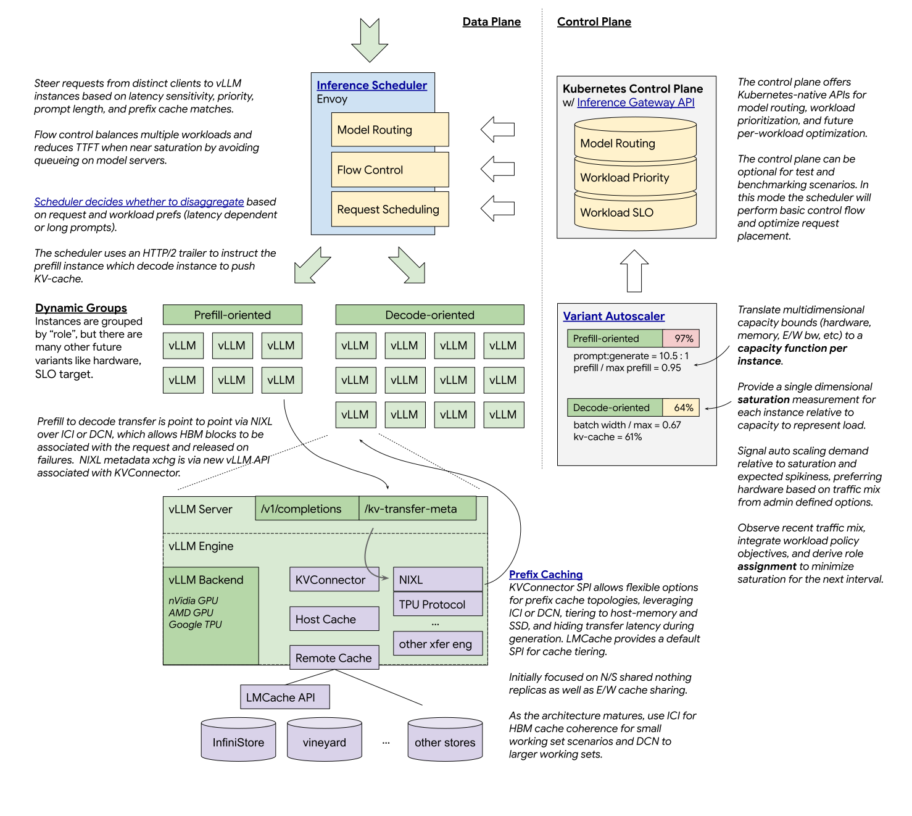

# llm-d: Kubernetes-native Distributed Inference at Scale

## Summary

Provide a well-lit path for anyone to serve large language models (LLMs) at scale, with the fastest
time-to-value and competitive performance per dollar for most models across most hardware
accelerators. Reduce operational toil for workload owners and inference platform teams by cleanly
integrating with Kubernetes and composing with existing infrastructure choices. Work deeply with
vLLM - the model server with the broadest ecosystem and most accessible extensibility - to rapidly
enable new distributed inference protocols.

<!--
This section is incredibly important for producing high-quality, user-focused
documentation such as release notes or a development roadmap. It should be
possible to collect this information before implementation begins, in order to
avoid requiring implementors to split their attention between writing release
notes and implementing the feature itself. Proposal authors and reviewers
should help to ensure that the tone and content of the `Summary` section is
useful for a wide audience.

A good summary is probably at least a paragraph in length.

In this section and below, wrap lines to a reasonable length to make it
easier for reviewers to cite specific portions, and to minimize diff churn on
updates.
-->

## Motivation

Generative AI inference serving for large language models (LLM) is complex at scale and the key techniques enabling that scale are broadly understood but sparsely implemented and yield high operational toil. 

A significant fraction of accelerators that host LLM inference run atop Kubernetes and are managed by inference platform teams who lack a well-lit path to deploy, scale, and customize efficient serving. These teams also seek high capacity utilization of their general purpose models across multiple client workloads including chat, summarization, search, agents, and emerging multi-modal applications, all of which exhibit high variance in cost, tolerance of latency, and operational priority.

The high cost of emerging prompt-heavy use cases means that many primary workload serving deployments must optimize multiple parts of the stack, especially prefix caching, to reach both latency and cost objectives. Workload authors need the flexibility to shape their architecture from standard components that do not limit future growth.

<!--
This section is for explicitly listing the motivation, goals, and non-goals of
this proposal.  Describe why the change is important and the benefits to users. The
motivation section can optionally provide links to [experience reports] to
demonstrate the interest in a proposal within the wider project.

[experience reports]: https://go.dev/wiki/ExperienceReports
-->

### Goals

* Well-lit paths for anyone to serve LLM at scale
* Bring ML ecosystem expertise into production-ready components for high scale serving
* Provide vLLM-native protocols for distributed inference across multiple accelerator families
* Offer an extensible and flexible inference scheduler to balance traffic
* Support multiple new workloads (agents, multi-modal, RAG/search) with clear reference architectures
* Compose with existing Kubernetes infrastructure choices

<!--
List the specific goals of the proposal. What is it trying to achieve? How will we
know that this has succeeded?
-->

### Non-Goals

* Prioritize non-Transformer model architectures (initially)
* Fork and carry changes that are not in our upstreams

<!--
What is out of scope for this proposal? Listing non-goals helps to focus discussion
and make progress.
-->

## Proposal

The `llm-d` project will start with the [Kubernetes Inference Gateway project](github.com/kubernetes-sigs/gateway-api-inference-extension) and the [vLLM model server](github.com/vllm-project/vllm) ecosystem to enable the four primary high-scale techniques:

* Tiered prefix cache hierarchy to improve request latency and throughput
* Disaggregated serving to reduce time-to-first-token latency
* LLM-optimized load balancing for better tail latency and workload prioritization and fairness
* Autoscaling for better accelerator efficiency over different hardware and serving configurations

The three initial layers of the runtime infrastructure are:

* Inference Scheduler - apply Kubernetes-native model routing, handle flow control, and orchestrate disaggregation
* vLLM - support point to point disaggregated serving as a native protocol over multiple hardware architectures
* Remote Prefix Cache - separate the operational scaling of replicas from the achievable hit rate

The project will measure success against:

* Achieved scale and performance on key distributed inference workloads
* Efficiency of serving (perf/$ at target latency)
* Reduction of operational toil, especially with increasing workload density

### User Stories (Optional)

#### Story 1

As an inference platform team, I can rapidly deploy a shared-nothing serving stack for most LLMs that can be scaled up with prefix caching on both HBM and host memory, fast prefix-cache aware routing, and independently scalable (often called `xPyD`) disaggregated serving. The stack has clear operational metrics and I can measure a significant throughput improvement over round-robin load balancing. The operational and reliability aspects of my stack varies across accelerator hardware only on characteristics tied to the intrinsic hardware, host, and networking configuration.

#### Story 2

As an inference platform team, I can deploy the [DeepSeek R1 inference system](https://github.com/deepseek-ai/open-infra-index/blob/main/202502OpenSourceWeek/day_6_one_more_thing_deepseekV3R1_inference_system_overview.md) in a full xPyD architecture and leverage expert parallelism at peak performance, while being able to reconfigure the stack to a diverse range of traffic distributions using standard Kubernetes primitives.

#### Story 3

As an inference platform team, I can autoscale disaggregated serving roles, different accelerator hardware, and tuned vLLM replicas within a single serving pool to match the current mix of workload traffic, reducing my overall cost to serve and expanding the range of usable capacity.

## Design Details

Our current Northstar designs lay out the initial scope (join llm-d-contributors@googlegroups.com to comment). They will be converted into project proposals:

* [vLLM-Optimized Inference Scheduler](https://docs.google.com/document/d/1kE1LY8OVjiOgKVD9-9Po96HODbTIbgHp4qgvw06BCOc/edit)
* [Disaggregated Serving with vLLM](https://docs.google.com/document/d/1FNN5snmipaTxEA1FGEeSH7Z_kEqskouKD1XYhVyTHr8/edit)
* [Prefix Cache Hierarchy](https://docs.google.com/document/d/1inTneLEZTv3rDEBB9KLOB9K6oMq8c3jkogARJqdt_58/edit)
* [Variant Autoscaling over Hardware, Workload, and Traffic](https://docs.google.com/document/d/1inTneLEZTv3rDEBB9KLOB9K6oMq8c3jkogARJqdt_58/edit)

## Alternatives

### Use NVIDIA Dynamo on GPUs

NVIDIA Dynamo offers an excellent integrated stack for low-latency and high scale serving. llm-d intends to work closely with the Dynamo team on finding the best way to integrate TensorRT-LLM, offer operational flexibility for multiple workloads via priority and fairness, and leveraging NIXL. We are prioritizing the inference scheduler as the key component to enhance Dynamo.

### Use AIBrix

AIBrix provides a strong research-focused and fast iterating integrated serving platform. llm-d intends to work closely with the AIBrix team to leverage their experience in autoscaling and serving to standardize components and best practices.

### Use Production Stack

production-stack is the easiest way to deploy vLLM onto Kubernetes. llm-d intends to work closely with the production-stack team to find common components and patterns to integrate, especially around prefix cache configuration.
